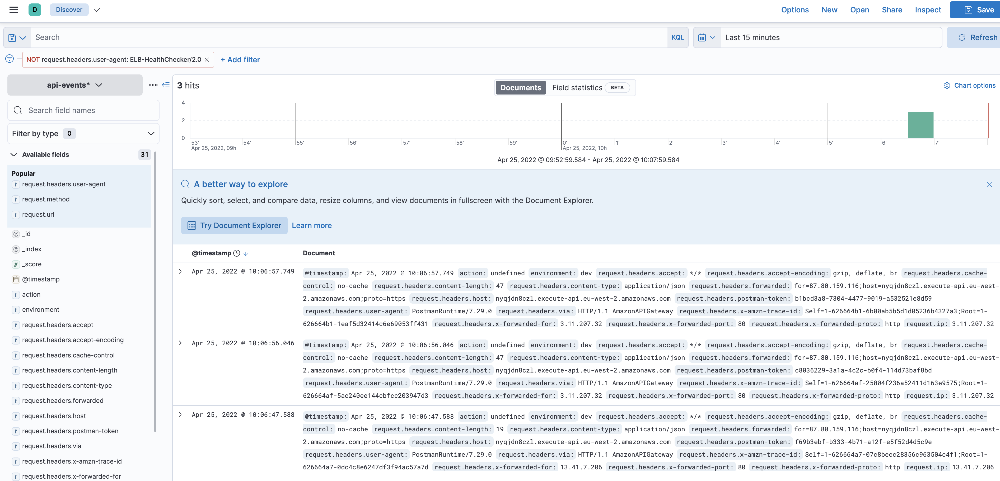

# CRUK Node.js Recruitment Assignment

### Stack

The stack consists of a Fargate service with autoscaling and ALB (application load balancer) capabilities which exposes an APIGateway that's run on ECS using Nodejs and express. Lambdas were considered but not chosen for this task due to their concurrenct execution limts (1000-99999), runtime limit of 900 seconds, memory limits and are generally more costly as the api scales up. 

## Requirements

- [Create an AWS account](https://portal.aws.amazon.com/gp/aws/developer/registration/index.html) if you do not already have one and log in. The IAM user that you use must have sufficient permissions to make necessary AWS service calls and manage AWS resources.
- [AWS CLI](https://docs.aws.amazon.com/cli/latest/userguide/install-cliv2.html) installed and configured
- [Git Installed](https://git-scm.com/book/en/v2/Getting-Started-Installing-Git)
- [AWS CDK](https://docs.aws.amazon.com/cdk/latest/guide/cli.html) installed and configured
- SES will need to be manually set on the console and the FROM email needs to be changed in the env file

## Deployment Instructions

1. Create a new directory, navigate to that directory in a terminal and clone the GitHub repository:
   ```bash
   git clone git@github.com:akshaychopra/cruk.git
   ```
2. Change directory to the pattern directory:
   ```bash
   cd cruk
   ```
3. Install dependencies:
   ```bash
   npm install
   ```
4. From the command line, configure AWS CDK:
   ```bash
   cdk bootstrap ACCOUNT-NUMBER/REGION # e.g.
   cdk bootstrap 1111111111/us-east-1
   cdk bootstrap --profile test 1111111111/us-east-1
   ```
6. From the command line, use AWS CDK to deploy the AWS resources for the pattern as specified in the `lib/cdk-stack.ts` file:
   ```bash
   cdk deploy
   ```
7. Note the outputs from the CDK deployment process. This contains the apigw endpoint that is used to make the GET/POST request

## How it works

- The image is constructed directly from sources on disk when `cdk deploy` is executed
- The image is automatically pushed to Amazon ECR
- The VPC and subnets are created
- The ECS cluster is created
- The Task Definitions are created
- The API Gateway Integration, Route, and VPC Link are created
- The Fargate Service is created
- Dynamo tables are created
- Logger task is created
- Elasticsearch server and kibana can be accessed at https://www.elastic.co/. Please ask for access if needed

## Testing

To run automated tests locally
```bash
   npm run test && cd src && npm run test
```

An already deployed api can be accessed at at https://nyqjdn8czl.execute-api.eu-west-2.amazonaws.com/. Please don't stress test it as it is hosted and paid by myself xD

To test the API using cURL, Retrieve the API Gateway URL from the `cdk deploy` output or use the link above. 


The API Gateway allows a GET request to `/` and POST to `/donate`. To call it, run the following:

```bash
curl --location --request GET '<REPLACE WITH API GATEWAY URL>'

# Example
curl --location --request GET 'https://nyqjdn8czl.execute-api.eu-west-2.amazonaws.com/'

# Post example
curl --location --request POST 'https://nyqjdn8czl.execute-api.eu-west-2.amazonaws.com/donate' \
--header 'Content-Type: application/json' \
--data-raw '{"user":"ak.chopra24@gmail.com","amount":"300"}'
```

## Cleanup

1. Delete the stack
   ```bash
   cdk destroy
   ```

# TypeScript Express server without Docker

Run the following to start the server on port 80:

```bash
cd src
npm install
npm run start
```

# TypeScript Express server with Docker
Have docker running and then run the following to start the server on port 80:

```bash
cd src
docker build . -t ts-express
docker rm ts-app && docker run -p 80:80 --name ts-app ts-express
```

# Monitoring and logging
All custom logs, access logs, requests, responses are registered om cloudwatch. Dashboards can be created to filter data and alarms can be created for critical inspections. Alarms can be created whenever application load gets too high or we add new CPUs

A much better monitoring solution than cloudwatch is a managed server at https://www.elastic.co/ with Kibana integrated. Please ask for access if required.


## Useful commands

 * `npm run build`   compile typescript to js
 * `npm run watch`   watch for changes and compile
 * `npm run test`    perform the jest unit tests
 * `cdk deploy`      deploy this stack to your default AWS account/region
 * `cdk diff`        compare deployed stack with current state
 * `cdk synth`       emits the synthesized CloudFormation template


# Future changes
- Automate SES using cdk (if possible)
- Implement env management such as Ansible. (.env files should never be committed. I have only added one for illustration)
- More elaborate testing, including and not limited to
   - mock and test email service
   - test each cdk policy
   - stress/load testing for scability and load balancing tests

